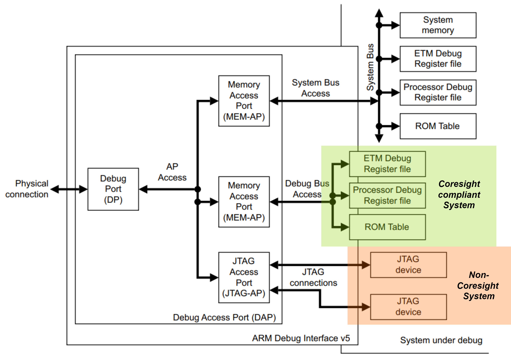

## 0 Background

Arm's definition of the debug architecture is scattered across three documents:

- Arm ARM[Arm ARM][1], as an instruction set manual, defines the debug/trace function within the processor, which is also the cornerstone of the debug debugging architecture
- Coresight[Coresight][2] architecture defines debug/trace behavior that is compatible with ARM processors, essentially an extension of the debug feature in Arm architecture
- ADI[ADI][3] architecture defines the specification for the physical connection (JTAG/SWD) between Arm based SoC and the external environment

> The meaning of the name Corespight is to provide users with a visibility into the kernel. Both ARM's own legacy design suite RealView and the RISC-V camp's Sifive Insight express the same meaning

Readers familiar with these three documents will feel that they appear to have a clear division of the debug function and can effectively achieve the goal of building a unified Arm style debug infrastructure in SoC. However, from the perspective of a beginner, this decentralized architecture may be confusing. In particular, while developing a debug document independent of Arm ARM, Arm proposed two rather than one unified document, which is intuitively confusing. Considering the significant overlap in the architecture documents between Corespight and ADI, as well as the chaotic compatibility between the two, this confusion will only deepen further.

This situation is to some extent determined by the order in which Corespight and ADI appeared in history. It should be clear that the emergence of Corespight is to address the issue of debugging multi-core architectures that were first introduced in ARM11. Prior to this, the debug feature defined by the Arm architecture was sufficient to handle single core debugging scenarios, and the debug interface at that time was entirely based on the JTAG scan chain approach.

That is to say, ADI existed before the advent of Corespight. After the emergence of Corespight, Arm did not simply merge it into Corespight in order to achieve forward compatibility with ADI. In this way, ADI is architecturally compatible with the emerging multi-core Core sight architecture and the so-called legacy scan chain based (non Core sight) architectures of ARM7 and ARM9. The former uses MEM-AP access in ADI, while the latter uses JTAG-AP access, which is also one of the meanings of the AP topology diagram in ADI documents.

[1]: https://developer.arm.com/documentation/ddi0487/ja/?lang=en
[2]: https://developer.arm.com/documentation/ihi0029/f/?lang=en
[3]: https://developer.arm.com/documentation/ihi0074/d/?lang=en
